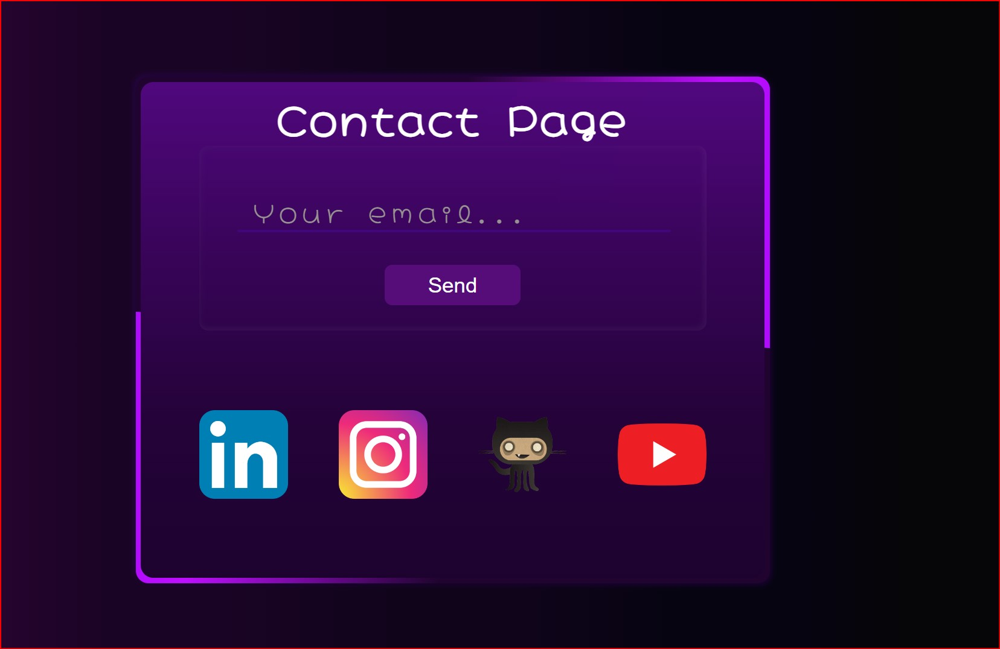

# Página de Contacto en **Stream** :movie_camera:

## Objetivos Personales :bulb:

- [x] Interactividad.
- [x] Diseño atractivo.
- [x] Colores uniformes.
- [x] Practicar y consolidar conceptos.

---



---

## Tecnologías :wrench:

- **HTML**
  - Estructura básica de la página.
  - Semántica y jerarquía de las etiquetas.
- **SCSS**
  - Estilo y diseño de la página.
  - Modularización de los estilos.

## Estructura del Proyecto

> La página de contacto se divide en las siguientes secciones:

1. **Main**: Contenedor de los componentes.
2. **Form**: Componente que refleja la interacción y se enfoca en la accesibilidad **_aria-label_**.
3. **Section**: Contiene los enlaces, con la disposición de iconos.

## Instalación y Uso :electric_plug:

1. **Clona el repositorio:**

```bash
git clonehttps://github.com/3eze3/Contact-Page.git
```

2. **Navega al directorio del proyecto:**

```bash
   cd Contact\ Page/
```

> **Abre el archivo index.html en tu navegador para ver la página de error en acción.**
